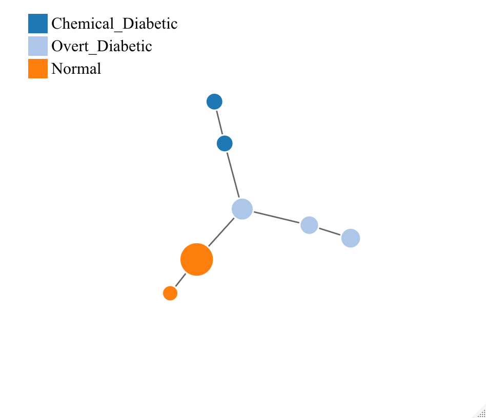

# Detecting Diabetes Using Mapper

In this program we apply the mapper algorithm to a diabetes data set and
successfully classify our data into three distinct categories - those
without diabetes, those with overt diabetes and those with chemical
diabetes.

We first load the required libraries.

    library(TDAmapper)
    library(igraph)

    ## 
    ## Attaching package: 'igraph'

    ## The following objects are masked from 'package:stats':
    ## 
    ##     decompose, spectrum

    ## The following object is masked from 'package:base':
    ## 
    ##     union

    library(networkD3)
    library(locfit)

    ## locfit 1.5-9.5    2022-03-01

These are functions that will later be used to create an interactive
3*D* graph.

    mapperVertices <- function(m, pt_labels) {
      
      # Hovering over vertices gives the point labels:
      # convert the list of vectors of point indices to a list of vectors of labels
      labels_in_vertex <- lapply( m$points_in_vertex, FUN=function(v){ pt_labels[v] } )
      nodename <- sapply( sapply(labels_in_vertex, as.character), paste0, collapse=", ")
      nodename <- paste0("V", 1:m$num_vertices, ": ", nodename )
      
      # Hovering over vertices gives the point indices:
      # list the points in each vertex
      # nodename <- sapply( sapply(m$points_in_vertex, as.character), paste0, collapse=", ")
      # concatenate the vertex number with the labels for the points in each vertex
      #nodename <- paste0("V", 1:m$num_vertices, ": ", nodename )
      
      nodegroup <- m$level_of_vertex
      nodesize <- sapply(m$points_in_vertex, length)
      
      return(data.frame( Nodename=nodename, 
                         Nodegroup=nodegroup, 
                         Nodesize=nodesize ))
      
    }

    mapperEdges <- function(m) {
      linksource <- c()
      linktarget <- c()
      linkvalue <- c()
      k <- 1
      for (i in 2:m$num_vertices) {
        for (j in 1:(i-1)) {
          if (m$adjacency[i,j] == 1) {
            linksource[k] <- i-1
            linktarget[k] <- j-1
            linkvalue[k] <- 2
            k <- k+1
          }
        }
      }
      return( data.frame( Linksource=linksource,
                          Linktarget=linktarget, 
                          Linkvalue=linkvalue ) )
      
    }

We load the chemdiab data set, a chemical diabetes data set, and create
a distance matrix from the data points.

    data(chemdiab)
    #summary(chemdiab)

    normdiab <- chemdiab
    normdiab[,1:5] <- scale(normdiab[,1:5],center=FALSE)
    normdiab.dist = dist(normdiab[,1:5])

We will use a kernal density estimation function as the filter function
for mapper.

    library(ks)

    ## 
    ## Attaching package: 'ks'

    ## The following object is masked from 'package:igraph':
    ## 
    ##     compare

    filter.kde <- kde(normdiab[,1:5],H=diag(1,nrow = 5),eval.points = normdiab[,1:5])$estimate

We now run the mapper algorithm on our data set.

    diab.mapper <- mapper1D(
      distance_matrix = normdiab.dist,
      filter_values = filter.kde,
      num_intervals = 4,
      percent_overlap = 50,
      num_bins_when_clustering = 12)
    diab.graph <- graph.adjacency(diab.mapper$adjacency, mode="undirected")

The below graph is a visualization of the results of running the
algorithm.

The following code will produce an interactive version of the above
graph.

    l = length(V(diab.graph))
    Mode <- function(x) {
      ux <- unique(x)
      ux[which.max(tabulate(match(x, ux)))]
    }

    cc.maj.vertex <- c()
    filter.kde.vertex <- c()
    for (i in 1:l){
      points.in.vertex <- diab.mapper$points_in_vertex[[i]]
      Mode.in.vertex <- Mode(normdiab$cc[points.in.vertex])
      cc.maj.vertex <- c(cc.maj.vertex,as.character(Mode.in.vertex))
      filter.kde.vertex <- c(filter.kde.vertex,mean(filter.kde[points.in.vertex]))
    }

    vertex.size <- rep(0,l)
    for (i in 1:l){
      points.in.vertex <- diab.mapper$points_in_vertex[[i]]
      vertex.size[i] <- length((diab.mapper$points_in_vertex[[i]]))
    }

    MapperNodes <- mapperVertices(diab.mapper, 1:nrow(normdiab) )
    MapperNodes$cc.maj.vertex <- as.factor(cc.maj.vertex)
    MapperNodes$filter.kde <- filter.kde.vertex
    MapperNodes$Nodesize <- vertex.size

    MapperLinks <- mapperEdges(diab.mapper)

Running forceNetwork() will now produce an interactive version of the
graph visualization :

    # forceNetwork(Nodes = MapperNodes, Links = MapperLinks, 
    #              Source = "Linksource", Target = "Linktarget",
    #              Value = "Linkvalue", NodeID = "Nodename",
    #              Group = "cc.maj.vertex", opacity = 1, 
    #              linkDistance = 10, charge = -400,legend = TRUE,
    #              Nodesize = "Nodesize")  

# Conclusion

Using methods from topological data analysis we were able to detect 3
different clusters in our data. These correspond to the control group,
overt diabetics and chemical diabetics.

There is likely more information that can be extracted from this data
set, perhaps by using different filter functions and optimizing the
parameters of the mapper algorithm. I would be interested to see what
other features can be extracted and will continue to play around with
this data set in the future!
